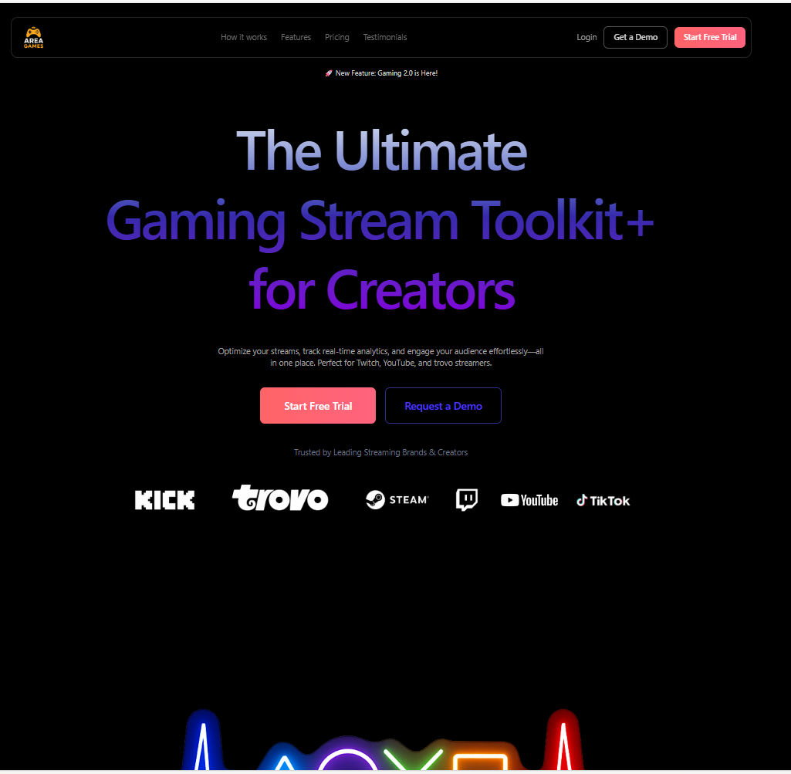
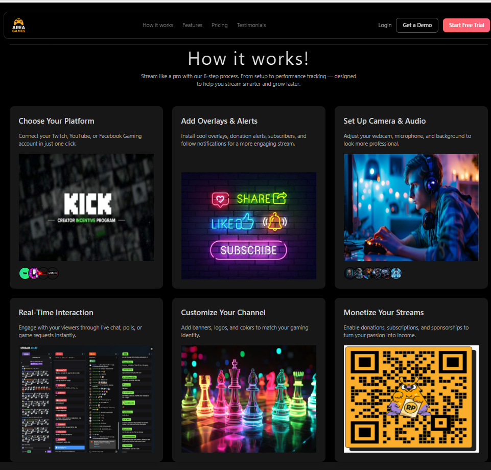
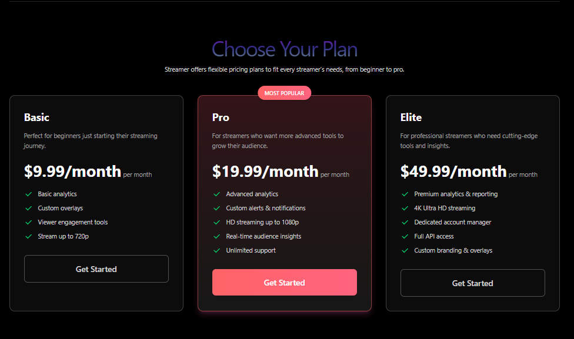
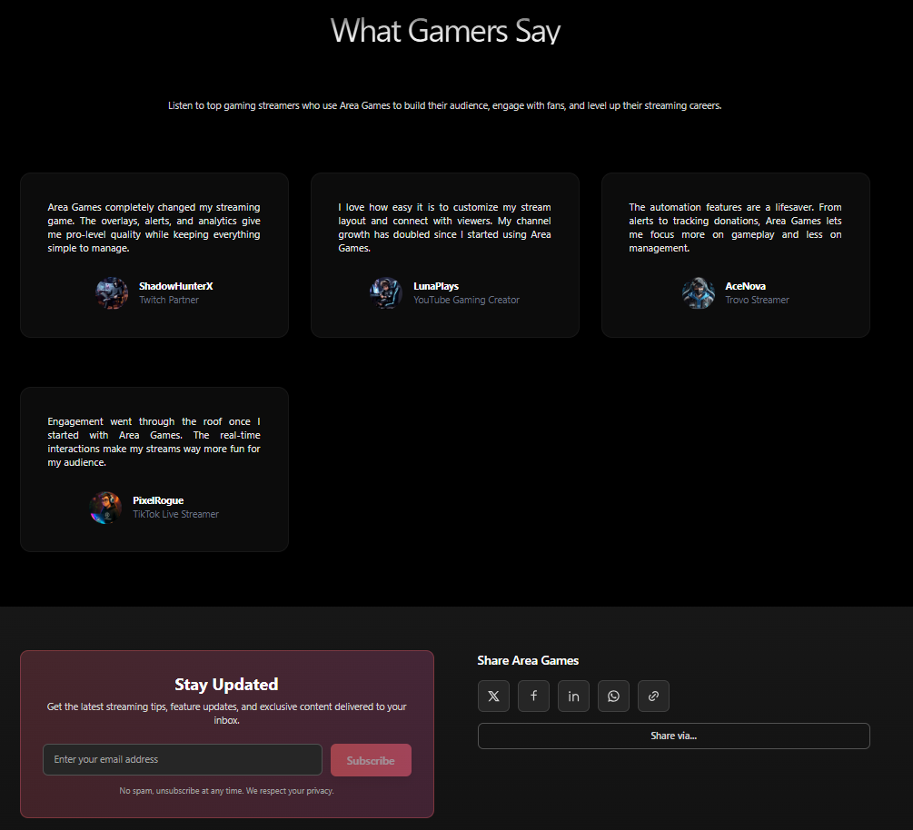

# Stream - Platform Streaming Multi-Channel

Platform streaming yang memungkinkan pengguna untuk melakukan streaming ke berbagai platform secara bersamaan seperti YouTube, Twitch, TikTok, dan platform lainnya.

## 🚀 Fitur Utama

- **Multi-Platform Streaming** - Stream ke berbagai platform sekaligus
- **Dashboard Interaktif** - Kelola semua streaming dari satu tempat
- **Real-time Analytics** - Monitor performa streaming secara real-time
- **Responsive Design** - Optimized untuk desktop dan mobile
- **Modern UI/UX** - Interface yang clean dan user-friendly

## 🛠️ Tech Stack

- **Frontend**: React 18 + Vite
- **Styling**: Tailwind CSS
- **Animations**: Framer Motion
- **Icons**: Remix Icons
- **Build Tool**: Vite

## 📦 Instalasi

```bash
# Clone repository
git clone <repository-url>
cd Stream

# Install dependencies
npm install

# Jalankan development server
npm run dev

# Build untuk production
npm run build
```

## 📁 Struktur Proyek

```
src/
├── component/          # Komponen React
│   ├── HeroSection.jsx # Landing page utama
│   ├── Navbar.jsx      # Navigation bar
│   ├── Features.jsx    # Fitur-fitur platform
│   ├── Works.jsx       # How it works section
│   ├── Pricing.jsx     # Paket harga
│   └── Button.jsx      # Komponen button reusable
├── constanst/          # Data statis dan konstanta
│   └── index.jsx       # Semua content website
├── assets/             # Gambar dan media
└── utils/              # Utility functions
```

## 🎨 Komponen Utama

### Button Component
Komponen button dengan 3 variant:
- `primary`: Gradient merah-rose untuk CTA utama
- `secondary`: Border indigo untuk aksi sekunder
- `outline`: Border neutral untuk aksi tambahan

### Constants (index.jsx)
File ini berisi semua data statis website seperti:
- Hero content
- Feature descriptions
- Pricing plans
- Testimonials
- Brand logos

### Icons
Menggunakan `@remixicon/react` untuk semua ikon interface.

## 🚀 Development

```bash
# Development mode
npm run dev

# Lint code
npm run lint

# Build production
npm run build

# Preview build
npm run preview
```

## 🌐 Deployment ke GitHub Pages

```bash
# Install gh-pages
npm install --save-dev gh-pages

# Deploy ke GitHub Pages
npm run deploy
```

**Langkah-langkah deployment:**
1. Push code ke GitHub repository
2. Jalankan `npm run deploy`
3. Aktifkan GitHub Pages di repository settings
4. Pilih branch `gh-pages` sebagai source
5. Website akan tersedia di: `https://username.github.io/Stream/`

## 📱 Responsive Design

Website fully responsive dengan breakpoints:
- Mobile: < 768px
- Tablet: 768px - 1024px
- Desktop: > 1024px






